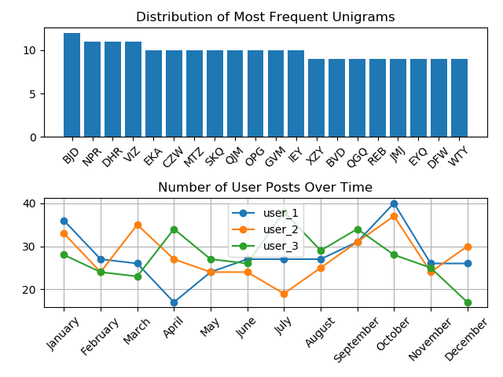

## Matplotlib Examples

This repository contains matplotlib examples that I copy when I write a new script or that I have often showed other people.

The tutorial code and comments show how to make line and bar graphs and how to format some aspects of the lines and plots. It also shows some useful aspects of python including default dictionaries, zip, sorting by value, dictionary comprehensions, and date manipulation.

